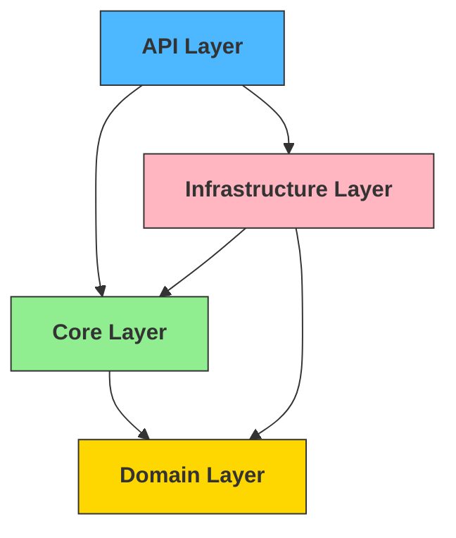
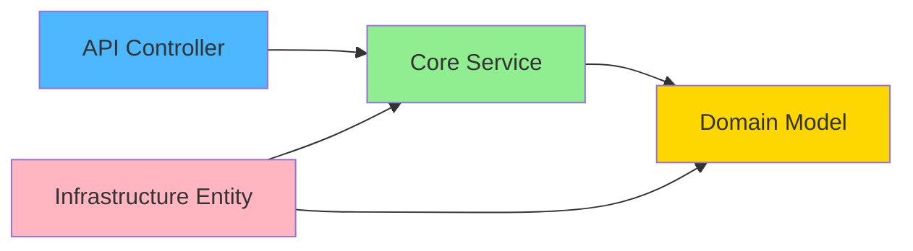
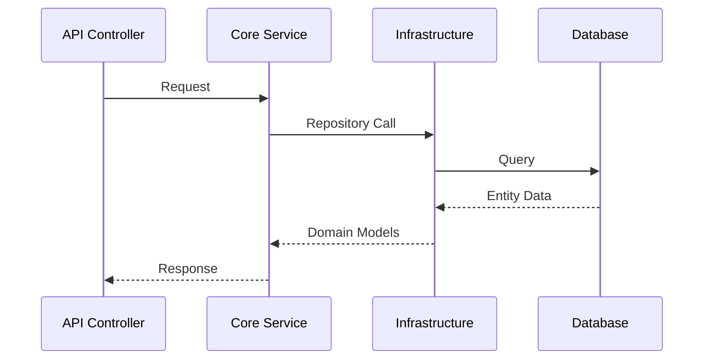

# Architectural Guidance: A Pragmatic Hybrid Approach to Clean Architecture

This document outlines a practical approach to Clean Architecture that balances theoretical purity with real-world development needs. It combines established patterns with modern .NET practices to create maintainable, testable, and scalable applications.

## 1. Layer Structure & Responsibility

The architecture is built on four distinct layers, each with specific responsibilities and boundaries. This separation ensures a clear organization of concerns while maintaining flexibility.



### Layer Responsibilities

Each layer has a distinct purpose and set of responsibilities:

| Layer          | Primary Role             | Example Components                       | Description                                                                                                               |
| -------------- | ------------------------ | ---------------------------------------- | ------------------------------------------------------------------------------------------------------------------------- |
| Domain         | Business Models & Rules  | `Project`, `ServiceContract`             | Contains pure business models, value objects, and rules. Framework-independent representation of business concepts.       |
| Core           | Use Cases & Interfaces   | `IProjectService`, `IAssociationService` | Defines application behavior through interfaces and use cases. Orchestrates domain models to perform business operations. |
| Infrastructure | Technical Implementation | `ProjectEntity`, `DbContext`             | Implements technical concerns, contains EF Core entities, and handles data persistence.                                   |
| API            | Entry Point & DI         | `Controllers`, `Program.cs`              | Handles HTTP requests, authentication, and serves as the composition root for dependency injection.                       |

## 2. Code Organization Pattern

The solution structure follows a clear organization pattern that emphasizes the separation between domain models and their infrastructure representations:

```
📁 Solution
├── 📁 API
│   ├── 📄 Program.cs (Composition Root)
│   ├── 📁 Controllers
│   └── 📁 Middleware
├── 📁 Domain
│   ├── 📁 Models             # Business/Domain models
│   ├── 📁 Enums             # Domain-specific enumerations
│   ├── 📁 Events            # Domain events
│   ├── 📁 Exceptions        # Domain-specific exceptions
│   └── 📁 ValueObjects      # Value objects for domain
├── 📁 Core
│   ├── 📁 Interfaces
│   │   ├── 📁 Repositories  # Repository interfaces
│   │   └── 📁 Services      # Service interfaces
│   ├── 📁 Services         # Service implementations
│   ├── 📁 DTOs             # Data transfer objects
│   └── 📁 Mappings         # Object mapping profiles
└── 📁 Infrastructure
    ├── 📁 Persistence
    │   ├── 📁 Contexts     # DbContext and configurations
    │   ├── 📁 Entities     # EF Core entities
    │   └── 📁 Mappings     # Entity type configurations
    ├── 📁 Services         # External service implementations
    ├── 📁 Repositories     # Repository implementations
    └── 📁 Migrations       # Database migrations
```

### Key Distinctions

#### Domain Models vs Infrastructure Entities

**Domain Models** (`Domain/Models/`):
```csharp
// Domain/Models/Project.cs
public class Project
{
    public Guid Id { get; set; }
    public string Name { get; set; }
    public ProjectStatus Status { get; set; }
    public ICollection<Task> Tasks { get; set; } = new List<Task>();
}

// Domain/Models/Task.cs
public class Task
{
    public Guid Id { get; set; }
    public string Title { get; set; }
    public bool IsCompleted { get; set; }
}

// Domain/Enums/ProjectStatus.cs
public enum ProjectStatus
{
    Active = 1,
    Completed = 2,
    Archived = 3
}
```

**Infrastructure Entities** (`Infrastructure/Persistence/Entities/`):
```csharp
// Infrastructure/Persistence/Entities/ProjectEntity.cs
public class ProjectEntity
{
    public Guid Id { get; set; }
    public string Name { get; set; }
    public int StatusId { get; set; }
    
    // Navigation properties
    public virtual ICollection<TaskEntity> Tasks { get; set; }
    public virtual ProjectStatusEntity Status { get; set; }
}

// Infrastructure/Persistence/Contexts/AppDbContext.cs
public class AppDbContext : DbContext
{
    public DbSet<ProjectEntity> Projects { get; set; }
    public DbSet<TaskEntity> Tasks { get; set; }

    protected override void OnModelCreating(ModelBuilder modelBuilder)
    {
        // Project configuration
        modelBuilder.Entity<ProjectEntity>(entity =>
        {
            entity.ToTable("Projects");
            entity.HasKey(e => e.Id);
            entity.Property(e => e.Name).IsRequired().HasMaxLength(200);
            entity.HasMany(e => e.Tasks)
                  .WithOne(e => e.Project)
                  .HasForeignKey(e => e.ProjectId);
        });

        base.OnModelCreating(modelBuilder);
    }
}
```

### Organization Principles

1. **Domain Models (`Domain/Models/`)**:
   - Pure business logic and rules
   - No persistence concerns
   - Rich domain behavior
   - Encapsulated state
   - Framework-independent
   - Use of value objects and domain events

2. **Infrastructure Entities (`Infrastructure/Persistence/Entities/`)**:
   - EF Core specific
   - Navigation properties
   - Database concerns
   - Foreign key relationships
   - Factory methods for conversion

3. **Factory Pattern for Entity-Model Conversion**:
```csharp
// Infrastructure/Persistence/Factories/ProjectFactory.cs
public static class ProjectFactory
{
    public static Project ToModel(ProjectEntity entity)
    {
        return new Project(
            id: entity.Id,
            name: entity.Name,
            status: (ProjectStatus)entity.StatusId,
            tasks: entity.Tasks?.Select(t => TaskFactory.ToModel(t)).ToList()
        );
    }

    public static ProjectEntity ToEntity(Project model)
    {
        return new ProjectEntity
        {
            Id = model.Id,
            Name = model.Name,
            StatusId = (int)model.Status,
            // Tasks will be handled by TaskFactory if needed
        };
    }
}
```

4. **Repository Implementation with Factory**:
```csharp
// Infrastructure/Repositories/ProjectRepository.cs
public class ProjectRepository : IProjectRepository
{
    private readonly AppDbContext _context;

    public async Task<Project> GetByIdAsync(Guid id)
    {
        var entity = await _context.Projects
            .Include(p => p.Tasks)
            .FirstOrDefaultAsync(p => p.Id == id);
        
        return entity != null ? ProjectFactory.ToModel(entity) : null;
    }

    public async Task CreateAsync(Project project)
    {
        var entity = ProjectFactory.ToEntity(project);
        _context.Projects.Add(entity);
        await _context.SaveChangesAsync();
    }
}

## 4. Dependency Flow Visualization



## 5. Service Communication Pattern



## 6. Clean Architecture Validation Rules

✅ **Allowed**:
- API → Core: Controllers use Core services
- API → Infrastructure (DI only): For dependency injection setup
- Core → Domain: Business logic uses domain models
- Infrastructure → Core: Implements Core interfaces
- Infrastructure → Domain: For data mapping

❌ **Prohibited**:
- Core → Infrastructure: Maintains Core's independence
- Core → API: Prevents circular dependencies
- Domain → Any Layer: Keeps domain pure
- Infrastructure → API: Maintains proper layering

## 7. Benefits of This Approach

| Aspect            | Benefit                             | Explanation                                                                           |
| ----------------- | ----------------------------------- | ------------------------------------------------------------------------------------- |
| 🎯 Maintainability | Clear separation of concerns        | Each layer has a single responsibility, making the code easier to maintain and modify |
| 🧪 Testability     | Core business logic easily testable | Business logic can be tested in isolation without infrastructure dependencies         |
| 🚀 Performance     | Reduced complexity, faster builds   | Fewer project dependencies and cleaner architecture lead to better performance        |
| 📦 Modularity      | Easy to replace implementations     | Interfaces allow for easy swapping of implementations without affecting other layers  |

## Conclusion

This hybrid approach balances architectural purity with practical development needs. It maintains core Clean Architecture principles while acknowledging real-world requirements, especially in modern .NET development.

Key Takeaways:
- Keep Domain models pure and focused on business rules
- Use Core layer for business logic orchestration
- Infrastructure handles persistence with separate entities
- API layer serves as Composition Root

Best Practices:
1. Always validate architectural boundaries during code review
2. Use dependency injection for loose coupling
3. Keep domain models clean and behavior-rich
4. Implement proper error handling across layers
5. Maintain clear documentation of architectural decisions
