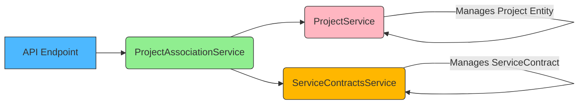
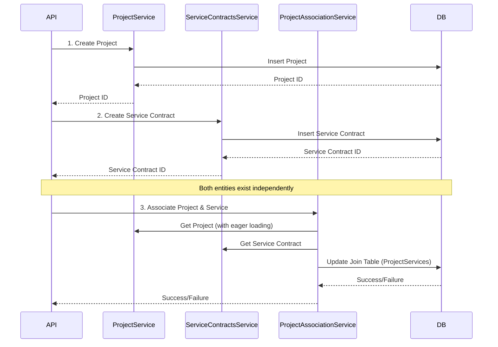

# Associations in Service-Oriented Architecture

This document explains the concept of associations in a service-oriented architecture, particularly focusing on managing many-to-many relationships between entities using a dedicated `ProjectAssociationService`.

## Understanding Associations

In a service-oriented architecture, especially when dealing with complex data models, you often encounter relationships between different entities.  A common scenario is a many-to-many relationship.  Let's consider an example with `Projects` and `Service Contracts`. A project can have multiple service contracts, and a service contract can be associated with multiple projects.

To manage these relationships effectively, especially in scenarios beyond simple CRUD operations, a dedicated **Association Service** is highly beneficial.

### Visualizing the Architecture

Here's a diagram illustrating the role of the `ProjectAssociationService`:



**Explanation:**

- **API Endpoint:**  The entry point for requests, interacting with the services.
- **ProjectAssociationService:**  The central service responsible for managing the associations between `Projects` and `ServiceContracts`. It orchestrates operations involving both `ProjectService` and `ServiceContractsService`.
- **ProjectService:**  Specifically manages `Project` entities (CRUD operations).
- **ServiceContractsService:**  Specifically manages `ServiceContract` entities (CRUD operations).

**Key Responsibilities of Each Service:**

| Service                     | Responsibility                                                   | Example Methods                                                              |
| --------------------------- | ---------------------------------------------------------------- | ---------------------------------------------------------------------------- |
| `ProjectService`            | CRUD operations for `Project` entities.                          | `CreateProjectAsync`, `GetProjectByIdAsync`                                  |
| `ServiceContractsService`   | CRUD operations for `ServiceContract` entities.                  | `CreateServiceContractsAsync`, `UpdateServiceContractsAsync`                 |
| `ProjectAssociationService` | Manages relationships between `Projects` and `ServiceContracts`. | `AttachServiceContractToProjectAsync`, `DetachServiceContractToProjectAsync` |

## Why a Separate Association Service?

Separating the association logic into its own service offers several advantages:

1. **Single Responsibility Principle:** Prevents bloating `ProjectService` or `ServiceContractsService` with relationship management logic. Each service remains focused on its core entity.
2. **Transaction Management:**  Association operations often involve multiple entities and database updates. A dedicated service can handle transaction management, ensuring data consistency across these operations.
3. **Clear Boundaries and Reduced Dependencies:**  Avoids circular dependencies between `ProjectService` and `ServiceContractsService`.  The `ProjectAssociationService` acts as an intermediary, maintaining clear boundaries.
4. **Reusability:** The `ProjectAssociationService` can be reused across different parts of the application (e.g., different controllers or endpoints) that need to manage project-service contract associations.

## Real-World Example Flow: Creation and Association

Let's illustrate the typical flow of creating a `Project`, a `ServiceContract`, and then associating them:



**Steps:**

1. **Create Project:** The API first calls `ProjectService` to create a new project. The `ProjectService` handles the CRUD operation for `Project` entities and interacts with the database to insert the project.
2. **Create Service Contract:** Separately, the API calls `ServiceContractsService` to create a new service contract.  Similar to `ProjectService`, `ServiceContractsService` manages `ServiceContract` entities and handles database interactions.
3. **Associate:** Finally, the API calls `ProjectAssociationService` to link the newly created `Project` and `ServiceContract`. The `ProjectAssociationService` is responsible for updating the join table in the database that represents the many-to-many relationship.

## Code Examples (C#)

Here's how this association process might be implemented in C# code:

### 1. Entity Creation (Separate Services)

```csharp
// ProjectService.cs
public class ProjectService
{
    private readonly ApplicationDbContext _context;
    
    public ProjectService(ApplicationDbContext context)
    {
        _context = context;
    }

    public async Task<Project> CreateProjectAsync(ProjectCreateDto projectDto)
    {
        var project = new Project
        {
            Name = projectDto.Name,
            Description = projectDto.Description,
            StartDate = projectDto.StartDate,
            // Map other properties as needed
        };

        _context.Projects.Add(project);
        await _context.SaveChangesAsync();
        return project;
    }

    public async Task<Project> GetProjectByIdAsync(int projectId)
    {
        return await _context.Projects
            .FirstOrDefaultAsync(p => p.Id == projectId);
    }
}

// ServiceContractsService.cs
public class ServiceContractsService
{
    private readonly ApplicationDbContext _context;
    
    public ServiceContractsService(ApplicationDbContext context)
    {
        _context = context;
    }

    public async Task<ServiceContract> CreateServiceContractAsync(ServiceContractCreateDto contractDto)
    {
        var contract = new ServiceContract
        {
            Title = contractDto.Title,
            Terms = contractDto.Terms,
            ValidFrom = contractDto.ValidFrom,
            ValidTo = contractDto.ValidTo,
            // Map other properties as needed
        };

        _context.ServiceContracts.Add(contract);
        await _context.SaveChangesAsync();
        return contract;
    }

    public async Task<ServiceContract> GetServiceContractByIdAsync(int contractId)
    {
        return await _context.ServiceContracts
            .FirstOrDefaultAsync(sc => sc.Id == contractId);
    }
}
```

### 2. Association Management (ProjectAssociationService)

```csharp
public class ProjectAssociationService
{
    private readonly ApplicationDbContext _context;
    private readonly ProjectService _projectService;
    private readonly ServiceContractsService _serviceContractsService;
    private readonly ILogger<ProjectAssociationService> _logger;

    public ProjectAssociationService(
        ApplicationDbContext context,
        ProjectService projectService,
        ServiceContractsService serviceContractsService,
        ILogger<ProjectAssociationService> logger)
    {
        _context = context;
        _projectService = projectService;
        _serviceContractsService = serviceContractsService;
        _logger = logger;
    }

    public async Task<Result> AttachServiceContractToProjectAsync(int projectId, int serviceContractId)
    {
        try
        {
            // Validate entities exist
            var project = await _projectService.GetProjectByIdAsync(projectId);
            var serviceContract = await _serviceContractsService.GetServiceContractByIdAsync(serviceContractId);

            if (project == null)
                return Result.Failure($"Project with ID {projectId} not found.");

            if (serviceContract == null)
                return Result.Failure($"Service Contract with ID {serviceContractId} not found.");

            // Check if association already exists
            var existingAssociation = await _context.ProjectServiceContracts
                .AnyAsync(psc => psc.ProjectId == projectId && psc.ServiceContractId == serviceContractId);

            if (existingAssociation)
                return Result.Failure("Association already exists.");

            // Create association
            var association = new ProjectServiceContract
            {
                ProjectId = projectId,
                ServiceContractId = serviceContractId,
                CreatedAt = DateTime.UtcNow
            };

            _context.ProjectServiceContracts.Add(association);
            await _context.SaveChangesAsync();

            return Result.Success();
        }
        catch (Exception ex)
        {
            _logger.LogError(ex, "Error attaching service contract {ServiceContractId} to project {ProjectId}", 
                serviceContractId, projectId);
            return Result.Failure("An error occurred while creating the association.");
        }
    }

    public async Task<Result> DetachServiceContractFromProjectAsync(int projectId, int serviceContractId)
    {
        try
        {
            var association = await _context.ProjectServiceContracts
                .FirstOrDefaultAsync(psc => 
                    psc.ProjectId == projectId && 
                    psc.ServiceContractId == serviceContractId);

            if (association == null)
                return Result.Failure("Association does not exist.");

            _context.ProjectServiceContracts.Remove(association);
            await _context.SaveChangesAsync();

            return Result.Success();
        }
        catch (Exception ex)
        {
            _logger.LogError(ex, "Error detaching service contract {ServiceContractId} from project {ProjectId}", 
                serviceContractId, projectId);
            return Result.Failure("An error occurred while removing the association.");
        }
    }
}

**Important Validation in `ProjectAssociationService`:**

```csharp
// Validation method example
private async Task<Result> ValidateAssociationRequestAsync(int projectId, int serviceContractId)
{
    var project = await _projectService.GetProjectByIdAsync(projectId);
    if (project == null)
        return Result.Failure($"Project with ID {projectId} not found.");

    var serviceContract = await _serviceContractsService.GetServiceContractByIdAsync(serviceContractId);
    if (serviceContract == null)
        return Result.Failure($"Service Contract with ID {serviceContractId} not found.");

    var existingAssociation = await _context.ProjectServiceContracts
        .AnyAsync(psc => psc.ProjectId == projectId && psc.ServiceContractId == serviceContractId);
    if (existingAssociation)
        return Result.Failure("Association already exists.");

    return Result.Success();
}
```

**Eager Loading for Associations:**

```csharp
public async Task<Project> GetProjectWithAssociationsAsync(int projectId)
{
    return await _context.Projects
        .Include(p => p.ProjectServiceContracts)
            .ThenInclude(psc => psc.ServiceContract)
        .FirstOrDefaultAsync(p => p.Id == projectId);
}

public async Task<List<ServiceContract>> GetServiceContractsForProjectAsync(int projectId)
{
    return await _context.ProjectServiceContracts
        .Where(psc => psc.ProjectId == projectId)
        .Select(psc => psc.ServiceContract)
        .ToListAsync();
}
```

## Database Impact

The `ProjectAssociationService` primarily interacts with a **join table** in the database. This table represents the many-to-many relationship between `Projects` and `ServiceContracts`.

Typically, this join table (e.g., `ProjectServiceContracts`) will have columns like:

- `ProjectId` (Foreign key referencing the `Projects` table)
- `ServiceContractId` (Foreign key referencing the `ServiceContracts` table)

This design keeps the core entity services focused on their respective entities while providing a clean and organized way to manage complex relationships.

## Handling Different Scenarios

Let's consider a few scenarios to understand the system's behavior:

**Scenario 1: Create a `ServiceContract` but Forget to Associate**

- The `ServiceContract` will exist in the database, managed by `ServiceContractsService`.
- No entry will be created in the join table managed by `ProjectAssociationService`.
- The `Project` entity will not be aware of this `ServiceContract` through its associations.
- The `ServiceContract` is accessible and manageable independently via `ServiceContractsService`.

**Scenario 2: Attempt to Add an Association Without Creating Entities**

- The validation within `ProjectAssociationService` (as shown in the code example) will prevent this.
- It ensures that both `Project` and `ServiceContract` exist before creating an association, maintaining data integrity.

**Scenario 3: Correct Activation Flow from Frontend**

The frontend flow should ensure that entities are created first before attempting association.

```typescript
// 1. Create project
const newProject = await api.post('/api/projects', projectData);

// 2. Create service
const newService = await api.post('/api/services', serviceData);

// 3. Associate them
await api.post(
  `/api/projects/${newProject.id}/services/${newService.id}`
);
```

## Entity Visibility Rules

| Service                     | Can See Associations?           |
| --------------------------- | ------------------------------- |
| `ProjectService`            | No                              |
| `ServiceContractsService`   | No                              |
| `ProjectAssociationService` | Yes (through explicit includes) |

This isolation ensures that each service is responsible for its primary entity and that association logic is centralized within the `ProjectAssociationService`.

## Frontend Flow Design Considerations

A well-designed frontend flow is crucial for a seamless user experience when working with associations:

**Entity Creation Sequence:**

1. **Create Project:** Use an API endpoint like `POST /api/projects` (handled by `ProjectService.CreateProjectAsync()`).
2. **Create Service Contract:** Use an API endpoint like `POST /api/services` (handled by `ServiceContractsService.CreateServiceContractsAsync()`).

**React State Management (Example):**

- After successful project creation, store the `projectId` in component state.
- Similarly, store the `serviceId` after service contract creation.
- Use loading states to disable UI elements during API requests.
- Implement error states to handle creation failures.

**Association Activation:**

- **API Endpoint:** `POST /api/projects/{projectId}/services/{serviceId}` (handled by `ProjectAssociationService.AttachServiceContractToProjectAsync()`).
- **UI Trigger:** Enable an "Associate" button only after both `projectId` and `serviceId` are successfully obtained and stored in the state. Disable the button during the association request.

**Error Handling:**

- If association fails but entities are created, provide a "Retry Association" option.
- If entity creation fails, guide the user back to the creation forms.

**State Cleanup:**

- Clear `projectId` and `serviceId` from state after successful association or when the component unmounts to prevent accidental re-associations.

**UI/UX Visual Flow:**

```
[Project Form] --(Submit)--> (Project Created, ID stored) --> [Service Form] --(Submit)--> (Service Created, ID stored) --> [Associate Button (Enabled)]
```

**Alternative Paths:**

- Consider allowing users to associate existing services to a new project or vice versa.

**Feedback Mechanisms:**

- Display association status (e.g., badges, icons).
- Show linked service counts on project details pages.
- Provide "detach" or "undo" options for associations.

## Security Considerations

- **API Protection:** The association endpoint (`/api/projects/{projectId}/services/{serviceId}`) should have the same authentication and authorization levels as entity creation endpoints.
- **Input Validation:** Frontend and backend should validate `projectId` and `serviceId` (e.g., ensure they are integers). Handle "404 Not Found" responses gracefully if IDs are invalid.
- **Error Handling:** Use `try-catch` blocks to handle potential errors during API calls and association processes.

## Conclusion

Using a dedicated `ProjectAssociationService` is a robust approach for managing many-to-many relationships in a service-oriented architecture. It promotes separation of concerns, improves transaction management, and enhances the maintainability and scalability of your application. By following these guidelines and considering both backend and frontend aspects, you can effectively implement and manage complex associations in your projects.

```
